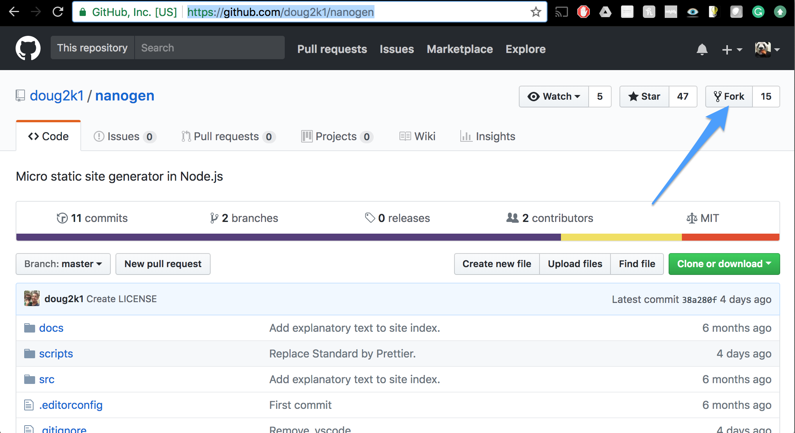
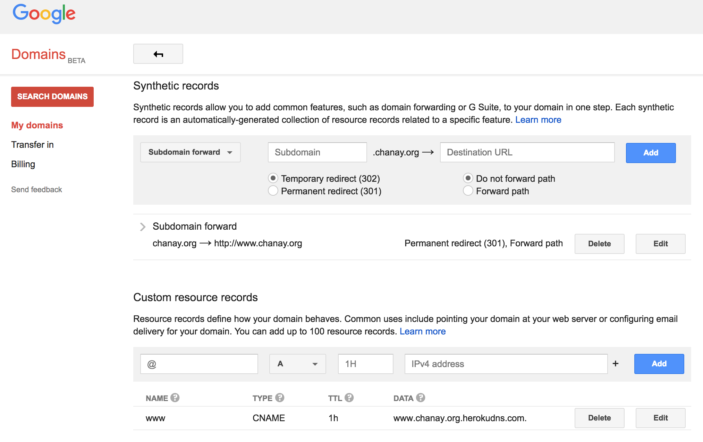

#### Get Accounts and Software

- Google Domains (http://domains.google.com)
- Heroku (https://signup.heroku.com/login)
- GitHub (https://github.com/join)


- Node.js (https://nodejs.org/en/download/)
- Heroku CLI (https://devcenter.heroku.com/articles/heroku-cli#download-and-install)
- Git CLI (https://git-scm.com/downloads)
- Text editor like Atom (https://atom.io/)

#### Fork the Nanogen project and repo name to your website
Nanogen (https://github.com/doug2k1/nanogen)


After forking to yourself, go to Settings and rename project "my-website" or something.

#### Clone locally, edit the package.json and what's in repo

```
cd ~
git clone https://github.com/<you>/my-website.git
cd my-website/
atom .
```

Edit the package.json scripts. Under `scripts` it needs a start for Heroku to work. Add `"start": "serve ./public"`

```
npm install
npm run build
```

This will have built the /public folder. Add it to the check in.

```
git add public/
git commit -m 'init'
git push
```

#### Make it into a Heroku app

Log in to your Heroku dashboard. Add a credit card to billing to validate your account. This deploy will be free but they need verification.

```
heroku create
```

```
git push heroku master
```

Your app will now be deployed at some link like https://glacial-anchorage-74911.herokuapp.com/

#### Become proud owner of a domain

Open account at Domains.Google.com or GoDaddy or whatever. Purchase a domain such as: `www.TheRightToKnowWhereBearsAre.com`

#### Point Heroku app to that domain

```
heroku domains:add www.therighttoknowwherebearsare.com
```

This will register a DNS target like: `www.therighttoknowwherebearsare.com.herokudns.com`

Create a custom resource records pointing to this target. And let naked link without www. route to it too. See Google Domains example.




1
